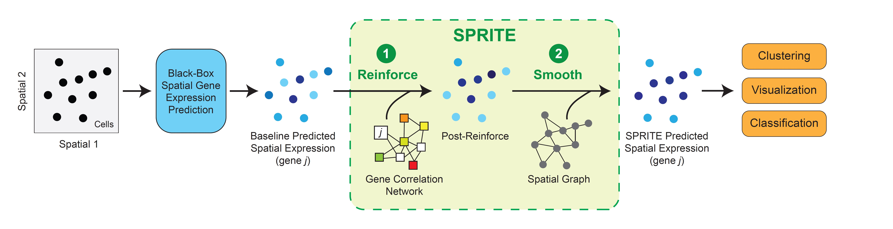

# SPRITE
**SPRITE (Spatial Propagation and Reinforcement of Imputed Transcript Expression)** is a meta-algorithm for post-processing spatial gene expression predictions to improve the quality of predictions and their utility in downstream analysis. It involves two steps: Reinforce followed by Smooth.




## Installation and setup

To install SPRITE locally, first clone the repository using git (you can install git following the instructions [here](https://github.com/git-guides/install-git)):

```
git clone https://github.com/sunericd/SPRITE.git
```

We recommend setting up a conda environment to install the requirements for the package (instructions for installing conda and what conda environment can do can be found [here](https://docs.conda.io/projects/conda/en/latest/user-guide/install/index.html)). Installation of requirements can then be done with the following commands:

```
conda create -n sprite python=3.8
conda activate sprite

cd SPRITE
pip install -r requirements.txt
```

To keep the requirements light, we have only included packages that are necessary for the core functionalities of SPRITE. For additional utilities such as gene prediction with Tangram, please install those packages separately (or uncomment those lines in `requirements.txt`).

To test the installation, you run through the Quick Start guide examples below.


## Quick Start

Below we outline a mini-tutorial to explore the main functionalities of SPRITE. For larger-scale examples, please refer to the code repository corresponding the figures and analyses generated for the SPRITE manuscript: https://github.com/sunericd/sprite-figures-and-analyses.git

NOTE: The initial prediction and data loading schemes are highly similar to another tool that we developed for estimating prediction uncertainty (TISSUE).

We start by importing SPRITE and other packages:


```python
# import packages

import sprite.sprite as sprite

import numpy as np
import pandas as pd
import matplotlib.pyplot as plt
import scanpy as sc
import anndata as ad
import os
```

We will use the osmFISH spatial transcriptomics data of mouse somatosensory cortex published by Codeluppi et al., 2018: https://doi.org/10.1038/s41592-018-0175-z, which is in ```test/data/```.

Note that we are using the SPRITE methods for building an AnnData object from tab-delimited text files for the spatial counts, scRNAseq counts, spatial locations, and spatial metadata. If you already have an AnnData object for the spatial data and another object for the scRNAseq data, you can skip this step.


```python
# load in spatial and scRNAseq datasets

adata, RNAseq_adata = sprite.load_paired_datasets("tests/data/Spatial_count.txt",
                                                       "tests/data/Locations.txt",
                                                       "tests/data/scRNA_count.txt")
```

    /home/edsun/anaconda3/envs/tissue/lib/python3.8/site-packages/anndata/_core/anndata.py:117: ImplicitModificationWarning: Transforming to str index.
      warnings.warn("Transforming to str index.", ImplicitModificationWarning)
    /home/edsun/anaconda3/envs/tissue/lib/python3.8/site-packages/anndata/_core/anndata.py:856: UserWarning: 
    AnnData expects .obs.index to contain strings, but got values like:
        [0, 1, 2, 3, 4]
    
        Inferred to be: integer
    
      names = self._prep_dim_index(names, "obs")


### Predicting spatial gene expression

Now we can impute any genes of interest that are found in the scRNAseq dataset but not in the spatial dataset. In this case, we will hold out a target gene from the spatial data and apply an imputation method to predict its expression using the scRNAseq dataset.

First, we preprocess the data and make sure that the gene names are matchable across the two datasets:


```python
# make genes lowercase
adata.var_names = [x.lower() for x in adata.var_names]
RNAseq_adata.var_names = [x.lower() for x in RNAseq_adata.var_names]

# preprocess RNAseq data
sprite.preprocess_data(RNAseq_adata, standardize=False, normalize=True)

# subset spatial data into shared genes
gene_names = np.intersect1d(adata.var_names, RNAseq_adata.var_names)
adata = adata[:, gene_names].copy()

# hold out target gene
target_gene = "plp1"
target_expn = adata[:, target_gene].X.copy()
adata = adata[:, [gene for gene in gene_names if gene != target_gene]].copy()
```

Now, we can make predictions of the target gene expression. In SPRITE, we have the SpaGE prediction method natively implemented (other methods will need to be installed). We will be using SpaGE in this example:


```python
# SpaGE spatial gene expression prediction

sprite.predict_gene_expression (adata, RNAseq_adata, [target_gene],
                                     method="spage", n_folds=10, n_pv=10)
```

The predicted spatial gene expression is stored in the input AnnData object under ```adata.obsm['spage_predicted_expression']```.

### SPRITE post-processing of predictions

The first step in SPRITE post-processing is the Reinforce step, which uses gene correlation information to correct prediction errors.

Note that this step is the most computationally expensive component of SPRITE so if the compute is a burden, we recommend only using the Smooth step and skipping Reinforce.

For Reinforce, we will set `alpha=0.1` (you can input an array-like to perform a search for `alpha` values as well).


```python
# Reinforce

sprite.reinforce_gene(adata, predicted="spage_predicted_expression",
                      alpha=0.1, tol=1e-8, cv=5)
```

    Using automatic Spearman gene correlation threshold: 0.254
    Propagation converged after 13 iterations


The second step in SPRITE is the Smooth step, which builds a spatial neighborhood graph and propagates information.


```python
# build spatial neighborhood graph
sprite.build_spatial_graph(adata, method="fixed_radius", n_neighbors=50)

# calculate cosine-based weights for edges
sprite.calc_adjacency_weights(adata, method="cosine")


# Smooth
sprite.smooth(adata, predicted="reinforced_gene_joint_spage_predicted_expression",
              alpha=0.1, tol=1e-8)
```

    Propagation converged after 12 iterations


In cases where you want to run Smooth without Reinforce, just set `predicted='spage_predicted_expression'`.

The predicted spatial gene expression matrices can be found in `adata.obsm` under the following keys:
- `'spage_predicted_expression'` - baseline predicted spatial gene expression
- `'reinforced_gene_joint_spage_predicted_expression'` - reinforced (intermediate) predicted spatial gene expression
- `'smoothed_reinforced_gene_joint_spage_predicted_expression'` - SPRITE predicted spatial gene expression
